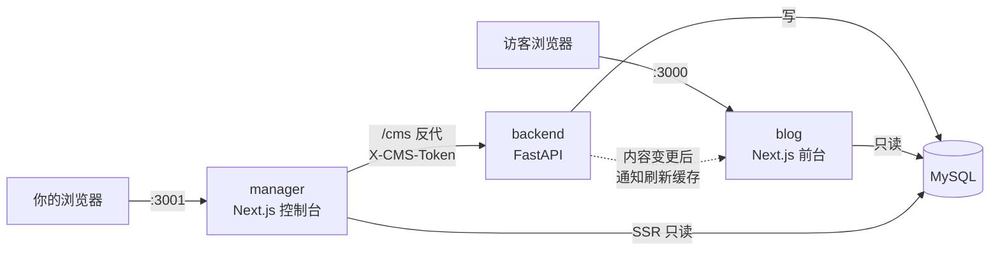

# XHBlogs Stack

原 `XHBlogs` + `my-blog-manager` 双工程的容器化重构版：**博客前台、管理控制台、CMS 后端、MySQL 四个容器，`docker compose up` 一键起飞。**

相比原版的三个核心变化：

1. **根路由改成了搜索起始页** —— 类似青柠起始页（时钟 / 问候语 / 一言 / 多引擎搜索），保留原博客的顶部导航栏。原来的博客主页移到 `/home`，左上角 Logo 指回根路由。
2. **数据全部存 MySQL** —— 数据库是唯一数据源，不再有 Markdown 文件、`siteConfig.ts`、`data/*.ts` 这些编译期常量。管理端保存后博客端立刻生效，不需要重新构建、不需要 Git、不需要 Vercel。
3. **管理端改为浏览器访问** —— 去掉了 pywebview 桌面壳，独立端口 + 密码登录。

---

## 目录结构

```
xhblogs-stack/
├── docker-compose.yml        # 四个服务的编排
├── .env.example              # 配置模板，复制成 .env 后修改
├── blog/                     # 博客前台 (Next.js 16)
├── manager/                  # 管理控制台 (Next.js 16)
├── backend/                  # CMS 后端 (FastAPI + SQLAlchemy)
├── db/
│   ├── init/
│   │   ├── 01-schema.sql     # 建表语句
│   │   └── 02-seed.sql       # 初始内容（仅首次建库时导入）
│   └── seed-source/          # 种子数据的原始 Markdown/JSON，运行时不读
└── tools/
    └── generate-seed.mjs     # 从 seed-source 重新生成 02-seed.sql
```

---

## 快速开始

```bash
cd xhblogs-stack
cp .env.example .env
# 打开 .env，把所有 change-me-* 改成你自己的强随机值
docker compose up -d --build
```

首次启动会依次完成：MySQL 初始化 → 导入表结构与初始内容 → 后端自举 admin 账号 → 前台与控制台就绪。约 1~3 分钟。

| 服务 | 默认地址 | 说明 |
|---|---|---|
| 博客前台 | http://localhost:3000 | 根路由是搜索起始页，`/home` 是博客主页 |
| 管理控制台 | http://localhost:3001 | 首次访问会跳转到 `/login` |
| CMS 后端 | *(不对外暴露)* | 仅容器内网可达，管理端经 `/cms` 反代访问 |
| MySQL | *(不对外暴露)* | 仅容器内网可达 |

管理端登录密码就是 `.env` 里的 `ADMIN_PASSWORD`，用户名 `admin`。

生成强随机值：

```bash
openssl rand -hex 32
```

---

## 环境变量

| 变量 | 必填 | 说明 |
|---|---|---|
| `MYSQL_ROOT_PASSWORD` | 是 | MySQL root 密码 |
| `MYSQL_DATABASE` | | 数据库名，默认 `xhblogs` |
| `MYSQL_USER` / `MYSQL_PASSWORD` | 是 | 应用连接数据库用的账号 |
| `ADMIN_PASSWORD` | 是 | 管理端登录密码；首次启动时写入 `admin_users` 表 |
| `SESSION_SECRET` | 是 | 管理端会话 Cookie 的 HMAC 签名密钥 |
| `CMS_TOKEN` | 是 | 管理端调用后端 API 的内部令牌 |
| `COOKIE_SECURE` | | 会话 Cookie 是否加 `Secure`。纯 HTTP 访问保持 `false`；挂了 HTTPS 反代后改 `true` |
| `BLOG_PORT` / `MANAGER_PORT` | | 对外端口，默认 3000 / 3001 |
| `TZ` | | 时区，默认 `Asia/Shanghai` |

---

## 架构



要点：

- **后端是唯一写库方。** 博客端和管理端的页面渲染都是直连 MySQL 只读；所有写操作都要经过 FastAPI，便于集中做鉴权和校验。
- **后端与 MySQL 都不发布端口**，只在 compose 的内部网络上可达。管理端通过 Next.js 的 `/cms/:path*` rewrite 把请求转发给后端，浏览器全程只和管理端自己的源打交道，没有跨域问题，也无法绕过登录直接打后端。
- **登录鉴权分两层**：浏览器 ↔ 管理端用 httpOnly 签名 Cookie（middleware 拦截），管理端 ↔ 后端用 `X-CMS-Token` 请求头。
- **所有页面都是 `force-dynamic`**，每次请求实时查库，所以管理端一保存，刷新前台就能看到。

---

## 数据模型

| 表 | 存什么 |
|---|---|
| `site_config` | 站点配置，键值对，值是 JSON 列 |
| `documents` | 文章与杂谈，`doc_type` 区分，`content` 存 Markdown 正文 |
| `moments` | 说说 |
| `pages` | 单页内容（关于我） |
| `drafts` | 草稿箱 |
| `albums` / `friends` / `projects` | 相册、友链、项目矩阵 |
| `admin_users` | 管理端账号，密码为 PBKDF2-SHA256 |

完整 DDL 见 `db/init/01-schema.sql`。

### 重新生成种子数据

`db/init/*.sql` **只在数据卷为空时执行一次**。如果你改了 `db/seed-source/` 里的原始内容并想重新生成：

```bash
cd blog && node ../tools/generate-seed.mjs
```

要让它重新导入，必须先销毁数据卷（**会清空所有数据**）：

```bash
docker compose down -v && docker compose up -d --build
```

---

## 起始页

根路由 `/` 是搜索起始页，包含时钟、问候语、一言、多引擎搜索框，**没有底部工具栏**。

- 内置必应 / 百度 / Google / GitHub / 知乎 / 哔哩哔哩 / 维基百科，可在 `blog/lib/searchEngines.ts` 里增删改。
- 搜索联想经由 `blog/app/api/suggest/route.ts` 服务端代理，避开浏览器跨域限制。
- 输入内容像网址时（如 `github.com`）会直接跳转而不是搜索。
- 快捷键：`/` 或 `Ctrl/Cmd + K` 聚焦，`Tab` 切换引擎，`↑ ↓` 选联想词，`Esc` 清空。
- 选中的引擎和"新标签页打开"偏好存在 localStorage。

一言取自 `hitokoto.cn`，接口不可用时回落到内置词库，见 `blog/app/api/hitokoto/route.ts`。

---

## 日常运维

```bash
docker compose logs -f blog          # 看某个服务的日志
docker compose restart manager       # 重启单个服务
docker compose up -d --build blog    # 改了代码后重新构建某个服务
docker compose down                  # 停止（保留数据）
docker compose down -v               # 停止并删除数据卷（注意：会清空数据库）
```

### 备份与恢复

```bash
# 备份
docker compose exec mysql mysqldump -u root -p"$MYSQL_ROOT_PASSWORD" \
  --default-character-set=utf8mb4 xhblogs > backup.sql

# 恢复
docker compose exec -T mysql mysql -u root -p"$MYSQL_ROOT_PASSWORD" \
  --default-character-set=utf8mb4 xhblogs < backup.sql
```

### 生产环境建议

- 前面挂一层 Nginx / Caddy 做 HTTPS 终止，把管理端限制在内网或加 IP 白名单。
- `.env` 权限设成 `600`，不要提交进 Git。
- 定期跑上面的 `mysqldump` 做备份。

---

## 本地开发（不用 Docker）

需要一个可连接的 MySQL，导入 `db/init/01-schema.sql` 和 `02-seed.sql`，然后：

```bash
# 后端
cd backend && pip install -r requirements.txt
MYSQL_HOST=127.0.0.1 uvicorn cms_core.main:app --reload --port 8000

# 博客前台
cd blog && npm install && MYSQL_HOST=127.0.0.1 npm run dev

# 管理控制台
cd manager && npm install && MYSQL_HOST=127.0.0.1 CMS_INTERNAL_URL=http://127.0.0.1:8000 npm run dev
```

---

## 故障排查

**管理端登录一直失败** —— 确认 `backend` 容器已启动且 `admin_users` 表里有 `admin` 行：

```bash
docker compose logs backend | Select-String admin
docker compose exec mysql mysql -u root -p"$MYSQL_ROOT_PASSWORD" xhblogs -e "SELECT username FROM admin_users;"
```

**博客页面空白 / 没有内容** —— 多半是数据库还没就绪或种子没导入：

```bash
docker compose exec mysql mysql -u root -p"$MYSQL_ROOT_PASSWORD" xhblogs -e "SELECT doc_type, COUNT(*) FROM documents GROUP BY doc_type;"
docker compose logs blog | Select-String "db"
```

**改了 `.env` 但不生效** —— compose 的环境变量在容器创建时注入，改完要重建：

```bash
docker compose up -d --force-recreate
```

**登录成功却一直跳回登录页** —— 会话 Cookie 带了 `Secure` 但你在用纯 HTTP 访问，浏览器不会回传。把 `.env` 里的 `COOKIE_SECURE` 设为 `false` 再 `docker compose up -d --force-recreate`。

**中文乱码** —— 检查数据库字符集，应该全都是 `utf8mb4`：

```bash
docker compose exec mysql mysql -u root -p"$MYSQL_ROOT_PASSWORD" -e "SHOW VARIABLES LIKE 'character_set%';"
```
